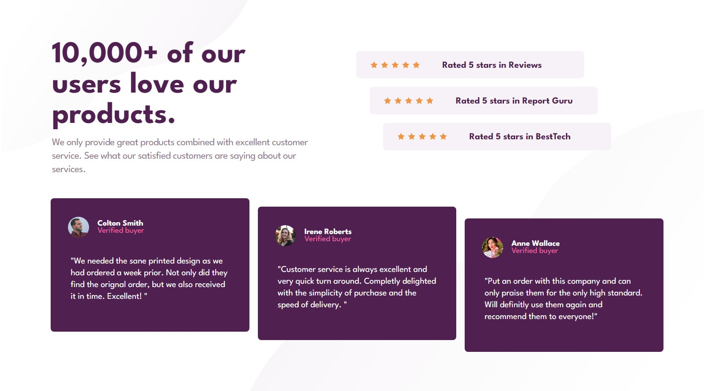

# Frontend Mentor - Social proof section solution

This is a solution to the [Social proof section challenge on Frontend Mentor](https://www.frontendmentor.io/challenges/social-proof-section-6e0qTv_bA). 

## Table of contents

- [Overview](#overview)
  - [The challenge](#the-challenge)
  - [Screenshot](#screenshot)
  - [Links](#links)

  - [Built with](#built-with)
  - [What I learned](#what-i-learned)
  - [Continued development](#continued-development)
  - [Useful resources](#useful-resources)
- [Author](#author)
- [Acknowledgments](#acknowledgments)

**Note: Delete this note and update the table of contents based on what sections you keep.**

## Overview

### The challenge

Users should be able to:

- View the optimal layout for the section depending on their device's screen size

### Screenshot




### Links

- Solution URL: [Add solution URL here](https://your-solution-url.com)
- Live Site URL: [Add live site URL here](https://your-live-site-url.com)

### Built with

- Semantic HTML5 markup
- CSS custom properties
- Flexbox
- Mobile-first workflow
- [Tailwind](https://tailwindcss.com/) - JS library

### What I learned

In this challenge I used tailwind css as my styling framework. It was for my first time using this utility based styling. I just became a fan of it but managing large strings of classes is actually a mess. This part was actually really a proud moment for me as I wasn't confident at all at first but actually pulled out this design.


```html
<div class="lower flex flex-col space-y-4 mt-[10vh] ml-2 lg:flex-row lg:justify-center lg:space-x-5 lg:mt-[2rem]  lg:space-y-0 lg:items-center xl:ml-5 2xl:h-[40vh]" > 
      <div class="person_a bg-Very_Dark_Magenta rounded-lg flex flex-col items-center h-[35vh] justify-center w-[95%]  sm:w-[95vw]  lg:w-[28vw]  lg:h-[300px]  lg:mt-2 lg:justify-start lg:mb-[5vh] lg:items-center  xl:h-[34vh] xl:space-y-7 2xl:self-baseline">
        <div class="name_sect flex flex-row self-start mt-4 lg:h-[20%] xl:ml-[2.53rem] xl:mt-[2.75rem] ">
          <div class="img h-[45px] w-[45px] bg-img_a bg-cover  rounded-full sm:h-[50px] sm:w-[50px]"></div>
          <div class="right">
            <ul class="flex flex-col list-none ml-5  ">
              <li class="text-white font-bold sm:text-[1.2rem]">Colton Smith</li>
              <li class="text-Soft_Pink sm:text-[1.2rem]">Verified buyer</li>
            </ul>
          </div>
        </div>
        <div class="sayings w-[80%] ">
          <p class="review_detailed text-lg leading-[1.5rem] text-white sm:text-2xl lg:text-lg lg:m-0 lg:mt-4 xl:text-[1.3rem] 2xl:[1.5vw] xl:m-0">"We needed the sane printed design as we had ordered a week prior. Not only did they find the orignal order, but we also received it in time. Excellent! "</p>
        </div>
```

### Continued development
I will be learning out React and advanced js but I will be using tailwind as my weapon. I can improve my designing by having a plan before actually writing code and also managing all the values which will be used in the project frequently to be included in tailwind.config.js file. Hope I will develop and improve further in this library.

### Useful resources
These resources were used during the learning process
- [Website clone using tailwind](https://www.youtube.com/watch?v=CJ3TNK4lkDU) - This helped me for creating mobile first designs, and I learned alot from it.

## Author

- Instagram - [@raffayeelahi](https://www.instagram.com/raffayeelahi)
- Frontend Mentor - [@raffayelahi](https://www.frontendmentor.io/profile/raffayelahi)
- Twitter - [@raffayelahi](https://www.twitter.com/raffayelahi)


## Acknowledgments
i listened about this framework so much so I decide to work with it. It was my first time, definitely alot of things to improve. Indeed, practice will my grip stronger over this framework.
